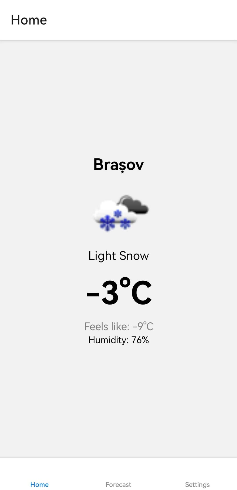
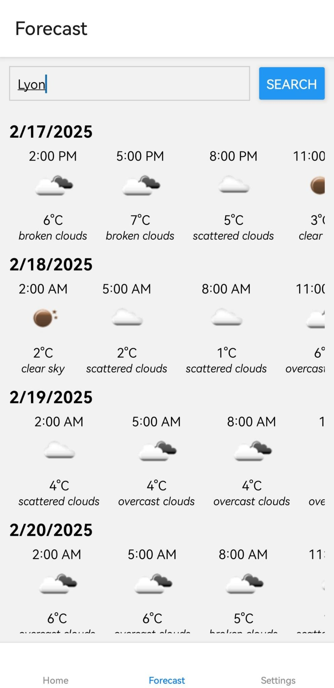
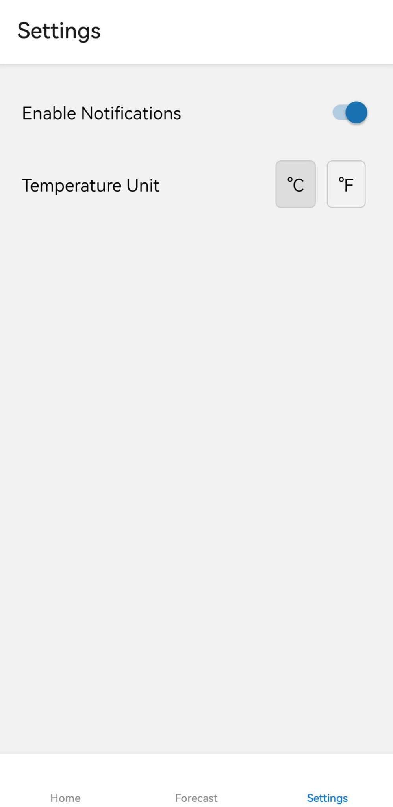

# RainReady - Mobile Weather Application

[](https://reactnative.dev/)
[](https://expo.dev/)
[](https://www.typescriptlang.org/)

## Description

RainReady is a mobile-first weather application built using React Native, TypeScript, and Expo.  It provides users with essential weather information, including current conditions and forecasts, directly on their mobile devices.  The app focuses on offline functionality by leveraging local storage to save weather data for searched cities, ensuring access even without an internet connection.  Users can also customize their experience with notification settings and temperature unit preferences.

**Important Note: Mobile-Only Application**

This application is designed and built exclusively for mobile platforms (iOS and Android). It is **not compatible with web browsers** due to the use of `expo-sqlite` for local data storage, which is not supported in Expo's web environment.

## Technologies Used

* **React Native:**  JavaScript framework for building native mobile apps.
* **TypeScript:**  Superset of JavaScript that adds static typing for improved code maintainability.
* **Expo:**  Framework and platform for universal React applications, simplifying development and deployment.
* **Expo SQLite (`expo-sqlite`):**  SQLite database module for Expo apps, used for offline data storage of weather forecasts.
* **Weather API Used:**  OpenWeatherMap.

## Features

* **Home Screen:**
    * Displays the **current temperature** for the user's **current location**.
    * Automatically updates weather information based on device location (with location permissions granted).
* **Forecast Page:**
    * **Search for cities:** Users can search for weather forecasts in any city.
    * **6-day forecast:** Provides a detailed 6-day weather forecast for the searched city.
    * **Offline Access:** Weather data for searched cities is **saved locally using SQLite**. This allows users to view forecasts for previously searched cities even when offline.
* **Settings Screen:**
    * **Weather Notifications:** Users can **enable or disable weather notifications**.
    * **Temperature Unit Selection:**  Allows users to choose between **Celsius (°C) and Fahrenheit (°F)** for temperature displays.

## Screenshots

### Home Screen - Current Weather

Shows the current temperature and weather for the user's location. 
<center>
  
</center>

### Forecast Page - City Search and 6-day Forecast

Demonstrates searching for a city and viewing the 6-day forecast.
<center>
  
</center>

### Settings Screen - Notifications and Units

Shows the settings screen with options for rain notifications, temperature change notifications, and unit selection.
<center>
  
</center>

## Setup and Installation

1.  **Clone the repository:**
    ```bash
    git clone https://github.com/CostiVoicu/RainReady
    cd RainReady
    ```
2.  **Install dependencies:**
    ```bash
    npm install
    ```
3.  **Install Expo CLI globally (if you don't have it):**
    ```bash
    npm install -g expo-cli
    ```
4.  **Start the Expo development server:**
    ```bash
    expo start
    ```
5.  **Run on your mobile device:**
    *   **Expo Go App:** Download the **Expo Go** app on your iOS or Android device. Scan the **QR code** displayed in your terminal or browser with the Expo Go app to open the app.

## Usage

*   **Home Screen:** Upon launching the app, allow location access to view the current temperature for your location. The app will periodically update the weather data.
*   **Forecast Page:**
    *   Tap on the **"Forecast" tab**.
    *   Use the **search bar** to enter the name of a city you want to check the forecast for.
    *   The **6-day forecast** will be displayed. This data will be saved locally for offline access.
*   **Settings Screen:**
    *   Navigate to the **"Settings" screen**.
    *   **Notifications:** Toggle the **switches** to enable or disable rain and sudden temperature change notifications.
    *   **Temperature Units:** Select either **"Celsius"** or **"Fahrenheit"** to change the temperature units used throughout the app.